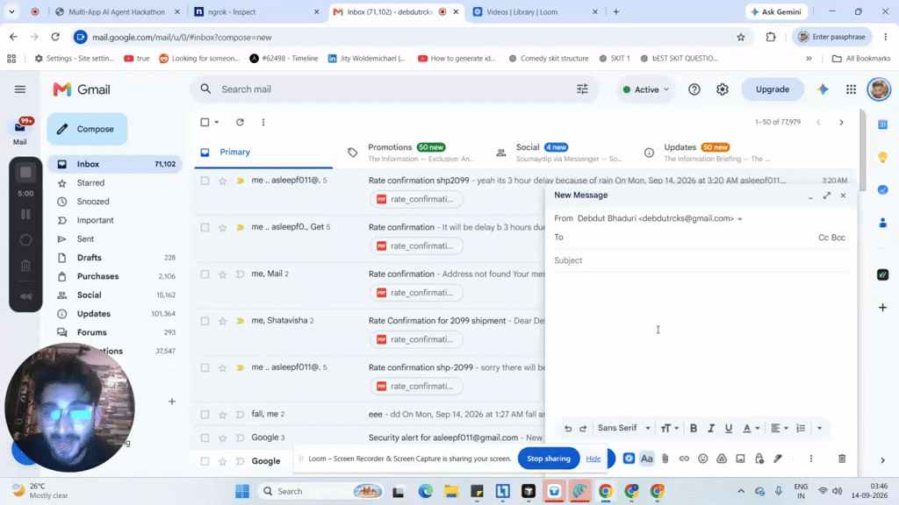
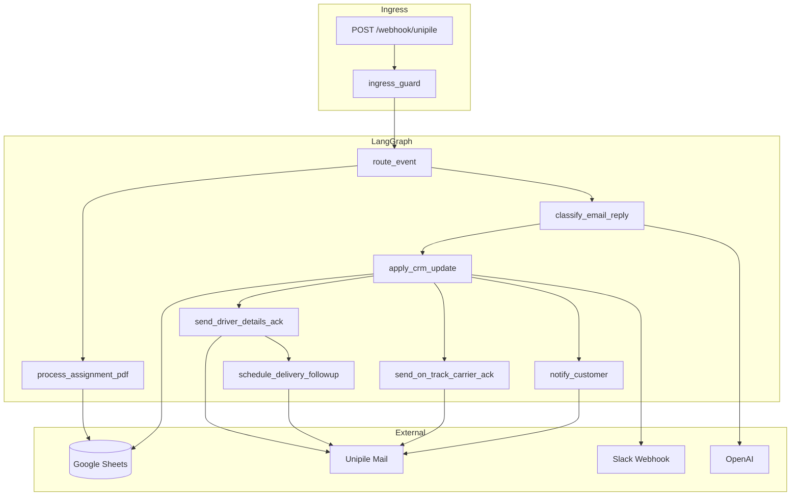

## Demo video

<p align="center">
  <a href="https://www.loom.com/share/3a8a2258c3b2460e955252462354155f">
    
  </a>
</p>

<p align="center"><strong><a href="https://www.loom.com/share/b31057dc845141c0ab0d522e068b3c4f">▶ Watch full demo on Loom</a></strong></p>

# Multi-App Shipment CRM Agent

LangGraph agent for freight operations: ingest carrier mail, maintain a Google Sheets CRM, classify thread replies with OpenAI, notify ops on Slack, and email customers when deliveries change.

---

## 01 — Project overview

### Problem

Freight teams juggle **email threads**, **spreadsheets**, and **PDF rate confirmations**. When a carrier sends driver details or reports a delay, someone must manually update the CRM, reply to the thread, and notify the customer.

### Solution

A **webhook-driven LangGraph workflow** that:

1. Links a **ratecon PDF** to a pre-seeded **Google Sheets** row
2. **Classifies** thread replies (driver details / on-track / delay) via **OpenAI**
3. Updates CRM fields, sends **carrier thank-you** and **delivery follow-up** via **Unipile**
4. On delay → **Slack alert** + **customer notice PDF** email

### Demo mail flow (4 messages)

| # | Trigger | Agent actions |
|---|---------|---------------|
| 1 | Ratecon PDF attachment | Extract shipment id → link `mail_thread_id` to sheet row |
| 2 | Driver details reply | Fill driver fields → carrier ack → schedule follow-up (~10s) |
| 3 | On-track reply | Update status → carrier confirmation |
| 4 | Delay reply | Update ETA + reason → Slack alert → customer PDF email |

---

## 02 — External apps used

| App | Role |
|-----|------|
| **Unipile** | Inbound email webhooks, read threads, send replies (Reply-All CC preserved) |
| **Google Sheets** | Shipment CRM — pre-seeded rows + live driver/delay updates |
| **Slack** | Ops delay alerts via incoming webhook |
| **OpenAI** | Classify email replies (`driver_details`, `delivery_status`, `delivery_delay`) |

---

## 03 — How it works

### Architecture diagram



### Code layers

| Layer | Path | Responsibility |
|-------|------|----------------|
| HTTP | `app/main.py`, `app/services/ingress_guard.py` | Webhook parse, idempotency, route to workflow |
| Graph | `app/workflows/`, `app/configs/workflow_config.py` | LangGraph nodes + pure routers |
| Services | `app/services/` | CRM, classification, Slack, customer notice, carrier ack |
| Tools | `app/tools/` | Mail, sheets, PDF, LLM helpers (plain args) |
| Integrations | `app/integrations/` | Unipile HTTP, Google Sheets API |

**Call direction:** `api → service → integration | compiled graph` — nodes stay thin and delegate to services.

### CRM model

Sheet tab **`Sheet1!A:N`** with columns:

`shipment_id`, `delivery_date`, `current_delivery_datetime`, `delay_reason`, `driver_name`, `driver_email`, `driver_phone`, `mail_thread_id`, `customer_email`, `assignment_pdf_link`, `latest_notice_link`, `customer_notice_version`, `status`, `last_customer_emailed_at`

**Pre-seeded rows:** if `shipment_id`, `delivery_date`, and `customer_email` exist before ratecon arrives, the agent **merges** new data (links thread) without overwriting those fields.

### Reply All CC

Outbound thread replies merge attendees from **all emails in the thread** (not just the latest message). The connected inbox (`UNIPILE_ACCOUNT_EMAIL`) and primary To recipient are excluded from CC.

### Workflow routing

Defined in `app/configs/workflow_config.py`:

- **Ratecon** → `process_assignment_pdf` → end
- **Reply** → `classify_email_reply` → `apply_crm_update` → ack / follow-up / on-track / notify customer

---

## 04 — Setup instructions

### Prerequisites

- Python 3.11+
- [uv](https://docs.astral.sh/uv/)
- Accounts: Unipile, Google Cloud (Sheets API + service account), Slack (incoming webhook), OpenAI

### Install

```bash
git clone https://github.com/YOUR_USER/multiapphackathon.git
cd multiapphackathon
uv sync
cp .env.example .env
```

Fill `.env` with your credentials (never commit `.env`).

### Google Sheets

1. Create a spreadsheet with header row matching `SHEET_COLUMNS` (see above).
2. Create a Google Cloud service account; download JSON locally.
3. Set `GOOGLE_SERVICE_ACCOUNT_JSON` to the JSON path and `GOOGLE_SHEET_ID` to the spreadsheet id.
4. Share the sheet with the service account email as **Editor**.

### Run locally

```bash
uv run uvicorn app.main:app --reload --port 8001
curl http://127.0.0.1:8001/health
```

### Unipile webhook (live demo)

Terminal 2 — expose your local server:

```bash
ngrok http 8001
```

Register in Unipile:

```text
https://<your-ngrok-domain>/webhook/unipile
```

**Ingress rules:**

- PDF workflow starts only when attachment name matches `rate_confirmation*.pdf`
- Thread replies run when the thread id matches an existing CRM row
- Other mail returns `200` with `"status": "ignored"`

Optional sample PDF:

```bash
uv run python scripts/generate_sample_pdf.py
```

### Fixture mode (no credentials)

```bash
# Windows
set FIXTURE_MODE=true
uv run python eval/run_demo.py
```

---

## 05 — Reliability testing

### Pre-demo gate (single command)

```bash
uv run python eval/run_demo.py
```

Runs **7 steps** across two fixture scenarios in [`eval/scenarios/`](eval/scenarios/):

| Scenario | Steps |
|----------|-------|
| **Happy path (SHP-2099)** | Pre-seed → ratecon → driver ack → follow-up → on-track |
| **Delay path (SHP-1042)** | Driver details → Slack + customer notice email |

### Additional checks

```bash
uv run python eval/run_eval.py   # 3 isolated regression cases
uv run pytest -q                 # unit tests (routers, CRM, mail, eval runners)
```

Full gate:

```bash
uv run pytest -q && uv run python eval/run_demo.py
```

Classification uses **fixture mocks** in eval mode (no OpenAI calls). Live demo uses real OpenAI + Unipile + Sheets.

---

## API

| Endpoint | Description |
|----------|-------------|
| `GET /health` | Health check |
| `POST /run` | Run workflow from JSON payload (manual / eval) |
| `POST /webhook/unipile` | Inbound Unipile email webhook |

Manual delay trigger example:

```bash
curl -X POST http://127.0.0.1:8001/run -H "Content-Type: application/json" -d "{\"event_type\":\"email_reply\",\"thread_id\":\"thread-1042\",\"fixture_classification\":{\"intent\":\"delivery_delay\",\"delay\":{\"delay_hours\":\"3\",\"reason\":\"Rain\"}}}"
```

---

## 90-second demo script

1. Run `uv run python eval/run_demo.py` — show **7/7 PASS** before going live.
2. Show Google Sheet row pre-seeded with `shipment_id`, `delivery_date`, `customer_email`.
3. Send ratecon PDF → row gets `mail_thread_id` linked.
4. Reply with driver details → sheet updates; carrier thank-you; follow-up after ~10s.
5. Reply on-track **or** delay → carrier ack **or** Slack + customer PDF email.

## License

MIT (or adjust as needed for hackathon submission).
